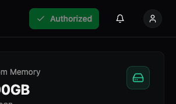
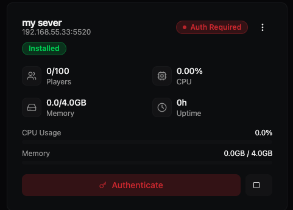
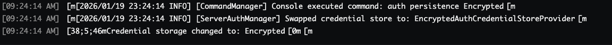

<div align="center">
  
</div>

# Hypanel - Self-Hosted Hytale Server Manager 

A Linux server manager tool for Hytale servers that allows you to create, install, update, and delete Hytale servers in a web GUI. Manage your servers with ease through a modern web interface.

## Features

- **Server Management**: Create, install, update, and delete Hytale servers via web GUI
- **Autostart**: Enable automatic server startup on system boot
- **Player Management**: View, kick, opp, or manage whitelist/banlist players
- **Backup Management**: Create and download server backups directly from your browser
- **Mod Management**: Upload, view, and delete mod files through the web interface
- **Real-time Monitoring**: Monitor server resource usage (CPU, memory) in real-time
- **Console Access**: Access and interact with server console logs via WebSocket

## Supported Systems

Hypanel is tested and supported on:
- **Ubuntu** 22.04, 24.04
- **Debian** 12, 13

> **Note**: Hypanel may work on other Linux distributions, but they are not officially supported. If you choose to use Hypanel on an unsupported distribution, you will be responsible for testing and troubleshooting any issues that may arise.

## Disclaimer

⚠️ **This tool is currently in a test/experimental phase.** There will likely be bugs or issues. Use at your own risk and report any problems you encounter.

## Installation

### Prerequisites

Install `curl` if it's not already installed:

```bash
# Ubuntu/Debian
sudo apt-get update && sudo apt-get install -y curl
```

### Installation Steps

1. **Run the installation script**:
   ```bash
   sudo bash -c "$(curl -fsSL https://raw.githubusercontent.com/OnyxWm/hypanel/main/install.sh)" 
   ```
   Or download and run the script manually:
   ```bash
   curl -fsSL https://raw.githubusercontent.com/OnyxWm/hypanel/main/install.sh -o install.sh
   sudo bash install.sh
   ```

2. **Access the web panel**: Visit `http://[your-server-ip]:3000` in your browser

3. **Login**: Use the password you created during the installation process

4. **Authorize the downloader**: Click the "Authorize" button at the top of the page to authorize the Hytale downloader. Once authorized, it will show "Authorized" status.

   
   
   After clicking authorize, you should see:
   
   

5. **Create and install a server**: From the dashboard, create a new server and install it.

6. **Authorize the server** (first start only):
   - When you start the server for the first time, it will show an "Auth Required" status
   
   
   
   - Click on the "Authenticate" button in the web interface
   - Run the `/auth login device` command in the server console
   - Copy the authorization link that appears in the console
   
   
   
   - Open the link in a new browser tab and sign in with your Hytale account
   - Once authorized, return to the console and run: `/auth persistence Encrypted save`
   - You should see confirmation that credential storage has been changed to Encrypted
   
   
   
   - Your server is now ready to accept connections!

### External Connections

For external connections outside of your home network, you will need to configure standard port forwarding on your router. Forward the server's port (shown in the server details, e.g., `5520`) to your server's local IP address. This allows players from outside your local network to connect to your Hytale server.

**Note**: Port forwarding configuration varies by router manufacturer. Consult your router's documentation or admin interface for specific instructions on how to set up port forwarding.

## Docker Installation

Hypanel can also be installed and run using Docker, which provides an isolated environment and easier deployment. Docker installation is recommended for users who prefer containerized deployments or want to run Hypanel alongside other containerized services.

### Prerequisites

- **Docker** 20.10+ and **Docker Compose** 2.0+ installed
- Supported architectures: **linux/amd64** (required), **linux/arm64** (optional)

### Quick Start

```bash
# 1. Clone the repository
git clone <repository-url>
cd hypanel

# 2. Run the setup script (prompts for password and configures everything)
./setup-docker.sh

# 3. Start Hypanel
docker-compose up -d
```

That's it! Access the web panel at `http://localhost:3000` and login with the password you set during setup.

### Installation Steps (Detailed)

**Option A: Automated Setup (Recommended)**

1. **Clone the repository**:
   ```bash
   git clone <repository-url>
   cd hypanel
   ```

2. **Run the setup script**:
   ```bash
   ./setup-docker.sh
   ```
   
   The script will:
   - Create `.env` file from `.env.example`
   - Prompt you for a password and generate a bcrypt hash
   - Create necessary data directories
   - Set proper permissions

3. **Start Hypanel**:
   ```bash
   docker-compose up -d
   ```

4. **Access the web panel**: Visit `http://localhost:3000` in your browser and login

**Option B: Manual Setup**

1. **Clone the repository**:
   ```bash
   git clone <repository-url>
   cd hypanel
   ```

2. **Create and configure `.env` file**:
   ```bash
   cp .env.example .env
   # Edit .env and set HYPANEL_PASSWORD_HASH or HYPANEL_PASSWORD
   ```

3. **Start Hypanel**:
   ```bash
   docker-compose up -d
   ```

See `.env.example` for all configuration options and password hash generation instructions.

### Docker Data Persistence

All persistent data is stored in local directories mounted as volumes:
- `./data` - Database and credentials
- `./servers` - Hytale server instances
- `./logs` - Application logs
- `./backup` - Server backups

These directories are created automatically when you start the container. To backup your installation, simply copy these directories.

### Configuration

All configuration is done through the `.env` file. The setup script creates this file automatically, or you can copy `.env.example` to `.env` and edit it manually.

**Key configuration options** (see `.env.example` for full list):

| Variable | Default | Description |
|----------|---------|-------------|
| `HYPANEL_AUTH_METHOD` | `ENV` | Authentication method: `ENV` (Docker default) or `PAM` |
| `HYPANEL_PASSWORD_HASH` | - | Bcrypt hash of password (recommended) |
| `HYPANEL_PASSWORD` | - | Plaintext password (testing only) |
| `PORT` | `3000` | HTTP API server port |
| `WS_PORT` | `3001` | WebSocket server port |
| `PUID` | `1000` | User ID for file permissions |
| `PGID` | `1000` | Group ID for file permissions |

**Password Hash Generation:**

If you need to generate a password hash manually, see instructions in `.env.example` or use:
```bash
node -e "const bcrypt = require('bcrypt'); bcrypt.hash('your-password', 10).then(h => console.log(h));"
```

### Docker Commands

```bash
# Start Hypanel
docker-compose up -d

# Stop Hypanel
docker-compose stop

# Restart Hypanel
docker-compose restart

# View logs
docker-compose logs -f

# View logs for last 100 lines
docker-compose logs --tail=100

# Stop and remove container (data volumes persist)
docker-compose down

# Rebuild container after code changes
docker-compose up -d --build

# Access container shell
docker-compose exec hypanel bash
```

### Differences from Linux Installation

- **Authentication**: Docker uses ENV mode by default (password from environment variable), while Linux installation uses PAM (system user password)
- **No systemd**: Docker handles process management, so systemd integration features are not available
- **Isolated environment**: All dependencies are contained within the Docker image
- **Easier updates**: Rebuild the container to update the application

### Troubleshooting

**Permission issues with volumes:**
- Ensure the `PUID` and `PGID` environment variables match your host user/group IDs
- Check that volume mount directories exist and have correct permissions

**Container won't start:**
- Check logs: `docker-compose logs`
- Verify that `.env` file exists and has `HYPANEL_PASSWORD_HASH` or `HYPANEL_PASSWORD` set
- Ensure ports 3000 and 3001 are not already in use
- Run `./setup-docker.sh` again to regenerate `.env` if needed

**Can't access web panel:**
- Verify the container is running: `docker-compose ps`
- Check port mappings in `docker-compose.yml`
- Ensure firewall allows connections to ports 3000 and 3001

## Documentation

For comprehensive documentation, guides, and detailed information about Hypanel, visit:

**https://docs.hypanel.app**

The documentation site includes detailed guides, API references, troubleshooting tips, and more.

## Uninstallation

To completely remove Hypanel from your system, run the uninstall script:

```bash
sudo bash -c "$(curl -fsSL https://raw.githubusercontent.com/OnyxWm/hypanel/main/uninstall.sh)"
```

Or download and run it manually:

```bash
curl -fsSL https://raw.githubusercontent.com/OnyxWm/hypanel/main/uninstall.sh -o uninstall.sh
sudo bash uninstall.sh
```

**Warning**: This will permanently delete all Hypanel data including server instances, configurations, databases, logs, and backups.

## Development

### Tech Stack

#### Backend
- **Node.js** 18+ with **Express 5.2.1** - REST API server
- **TypeScript 5.9.3** - Type-safe development
- **SQLite** (better-sqlite3 11.7.0) - Database
- **WebSocket** (ws 8.19.0) - Real-time communication
- **Winston 3.15.0** - Logging framework with daily rotation
- **Zod 3.23.8** - Schema validation
- **authenticate-pam 1.0.5** - PAM authentication for Linux
- **multer 2.0.2** - File upload handling
- **pidusage 4.0.1** - Process resource monitoring
- **ts-node-dev 2.0.0** - Development server with hot reload
- **tsx 4.19.2** - TypeScript execution for testing

#### Frontend
- **React 19.2.0** - UI framework
- **TypeScript 5.9.3** - Type-safe development
- **Vite 7.2.4** - Build tool and dev server
- **React Router 7.12.0** - Client-side routing
- **Tailwind CSS 4.1.9** - Utility-first CSS framework
- **Radix UI** - Accessible component primitives (various packages)
- **Recharts 2.15.4** - Data visualization
- **React Hook Form 7.60.0** - Form management
- **Zod 3.25.76** - Schema validation for forms
- **Sonner 1.7.4** - Toast notifications

### Project Structure

```
hypanel/
├── apps/
│   ├── backend/              # Node.js backend API and daemon
│   │   ├── src/
│   │   │   ├── api/          # REST API routes and middleware
│   │   │   │   ├── routes/   # API route handlers
│   │   │   │   └── middleware/# Authentication and validation
│   │   │   ├── websocket/    # WebSocket server
│   │   │   ├── server/       # Server management logic
│   │   │   ├── database/     # Database operations
│   │   │   ├── installation/ # Server installation logic
│   │   │   ├── storage/      # Configuration management
│   │   │   ├── logger/       # Logging utilities
│   │   │   ├── config/       # Configuration management
│   │   │   ├── systemd/      # Systemd integration
│   │   │   ├── types/        # TypeScript type definitions
│   │   │   ├── utils/        # Utility functions
│   │   │   └── errors/       # Error handling
│   │   ├── test/             # Test files
│   │   ├── daemon.ts         # Daemon entry point
│   │   └── README.md         # Backend-specific documentation
│   │
│   └── webpanel/             # React frontend application
│       ├── src/
│       │   ├── components/   # React components
│       │   │   └── ui/       # Reusable UI components
│       │   ├── pages/        # Page components
│       │   ├── contexts/     # React contexts
│       │   ├── lib/          # Utilities and API client
│       │   └── assets/       # Static assets
│       ├── public/           # Public assets (logo, favicon)
│       └── README.md         # Frontend-specific documentation
│
├── install.sh                # Installation script
├── uninstall.sh              # Uninstallation script
└── package.json              # Root package with dev scripts
```

### Prerequisites

- **Node.js** 18+ and npm (Node.js 24+ recommended for production)
- **Linux** operating system (for running Hytale servers)
- **SQLite3** (usually included with Node.js)
- **TypeScript** 5.9+ (installed as dev dependency)

### Development Setup

1. Clone the repository:
```bash
git clone <repository-url>
cd hypanel
```

2. Install root dependencies:
```bash
npm install
```

3. Install backend dependencies:
```bash
cd apps/backend
npm install
cd ../..
```

4. Install frontend dependencies:
```bash
cd apps/webpanel
npm install
cd ../..
```

### Running the Project

#### Development Mode (Recommended)

Run both backend and frontend concurrently from the root directory:

```bash
npm run dev
```

This will start:
- Backend API server on `http://localhost:3000`
- Frontend dev server on `http://localhost:5173` (or next available port)

#### Individual Services

You can also run each service separately:

**Backend only:**
```bash
# From root directory (runs production build)
npm run backend

# Or from backend directory (development mode with hot reload)
cd apps/backend
npm run dev
```

**Frontend only:**
```bash
# From root directory
npm run webpanel

# Or from webpanel directory
cd apps/webpanel
npm run dev
```

**Note**: The root `npm run backend` command runs the production build (`npm start`), while `npm run dev` from the backend directory uses `ts-node-dev` for hot reload during development.

#### Production Mode

**Backend:**
```bash
cd apps/backend
npm run build
npm start
```

**Frontend:**
```bash
cd apps/webpanel
npm run build
npm run preview
```

### Configuration

#### Backend Configuration

The backend can be configured via environment variables. See [apps/backend/README.md](./apps/backend/README.md) for detailed configuration options.

Default values:
- `PORT=3000` - HTTP API server port
- `WS_PORT=3001` - WebSocket server port
- `DATABASE_PATH=./data/hypanel.db` - SQLite database path
- `SERVERS_DIR=./servers` - Directory for server configurations
- `LOGS_DIR=./logs` - Directory for log files

#### Frontend Configuration

The frontend connects to the backend API. Update the API endpoint in `apps/webpanel/src/lib/api-client.ts` if your backend runs on a different port or host.

### API Documentation

#### REST API Endpoints

- `GET /api/servers` - List all servers
- `GET /api/servers/:id` - Get server details
- `POST /api/servers` - Create new server
- `DELETE /api/servers/:id` - Delete server
- `POST /api/servers/:id/start` - Start server
- `POST /api/servers/:id/stop` - Stop server
- `POST /api/servers/:id/restart` - Restart server
- `POST /api/servers/:id/command` - Send command to server
- `GET /api/servers/:id/logs` - Get server logs
- `GET /api/servers/:id/stats` - Get server resource stats
- `GET /health` - Health check

#### WebSocket

Connect to `ws://localhost:3001` (or configured WS_PORT) for real-time updates.

For detailed API documentation, see [apps/backend/README.md](./apps/backend/README.md).

### Building

**Backend:**
```bash
cd apps/backend
npm run build
```

**Frontend:**
```bash
cd apps/webpanel
npm run build
```

### Testing

**Smoke Tests:**
```bash
cd apps/backend
npm test
# or
npm run test:dev
```

Tests are run using **tsx** (TypeScript execution) and cover core workflows including:
- SQLite database operations and server persistence
- Install state machine with locking and retry logic  
- WebSocket event emission for real-time progress updates
- Full workflow integration from server creation to installation
- Filesystem safety checks

These tests use in-memory databases and mock services to avoid external dependencies and can be run as part of CI/CD pipelines.

### Linting

**Frontend:**
```bash
cd apps/webpanel
npm run lint
```

### System Service (Linux)

The backend can be run as a systemd service. See [apps/backend/README.md](./apps/backend/README.md) for detailed instructions.

## Contributing

Contributions are welcomed and encouraged! Any help fixing bugs, improving features, or enhancing documentation is greatly appreciated.

This project is currently in a test/experimental phase, so there are plenty of opportunities to help improve it. Whether you're fixing bugs, adding features, improving documentation, or suggesting enhancements, your contributions make a difference.

### How to Contribute

1. **Report Issues**: Found a bug or have a suggestion? Please open an issue on GitHub describing the problem or feature request.

2. **Submit Pull Requests**: 
   - Fork the repository
   - Create a feature branch (`git checkout -b feature/amazing-feature`)
   - Make your changes
   - Ensure code follows existing style and passes tests
   - Submit a pull request with a clear description of your changes

3. **Improve Documentation**: Help improve this README, code comments, or other documentation to make the project more accessible.

4. **Test on Different Systems**: Since this tool targets multiple Linux distributions, testing on different systems and reporting compatibility issues is valuable.

Thank you for considering contributing to Hypanel!

## License

This project is licensed under the MIT License. See the [LICENSE](LICENSE) file for details.

## Additional Documentation

- [Backend Documentation](./apps/backend/README.md) - Detailed backend setup and API documentation
- [Frontend Documentation](./apps/webpanel/README.md) - Frontend development guide
